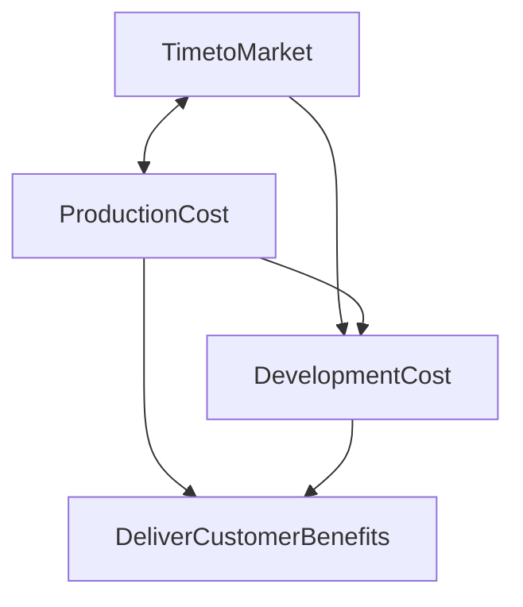

# ProductManagement Learn The Hardway

The contents of this repo is created based my learning of Product managment.
Specfically with new growing cloud and AI technology the approach for product managment is changing.

## Day 1: October 11

These are the learning from the MIT resources "Managing a Dispersed Product Development Process" by Ely Dahan and John R. Hauser.

## Challenge of Dispersed Product Development Process

Marketing, with its focus on the customer,has had great success. Tools such as conjoint analysis, voice-of-the-customer analysis,
perceptual mapping, intention scaling, portfolio optimization, and lifecycle forecasting are now in common use. Firms that continuously 
and efficiently generate new products that are in tune with their end customers’ needs and wants
are more likely to thrive. 
Direct communication with customers allows firms to learn from customers and tailor products to their requirements.

One of the core principles of development of perscriptive tools, resarches have studied the correlates of new product success identifying
communication between marketing and engineering as one of the most important factors in success. organizational process tools such as 
cross-function teams, quality function deployment , and co-location were developed to promote the sharing of ideas and the close integration
of engineering decisions with customer needs.

The new vision of product development is that of a highly disaggregated process with people and organizations spread throughout the world
. At the same time products are becoming increasing complex with typical electro-mechanical products requiring close to a million engineering 
decisions to bring them to market.

Competitive pressures mean that time to market has become as key to new product success as marketing’s orientation on customer needs and
customer satisfaction. Because products are marketed throughout the world, firms face the tradeoff between standardization for cost reduction and
variety for satisfying a broad set of customers. This has expanded the need for marketing tolook beyond the single product to focus on the
product platform.

## Product Development – End to End

Researchers in marketing believed that the key to success was a better understanding of the voice of the customer and a better ability to 
link that voice to the engineering decisions that are made in launching a product.

Today, both industry and academia view successful product development as an integrated process that must overcome many
tradeoffs, as depicted in Figure. Customer satisfaction, time to market, and cost reduction through total quality management are all
important, but none is viewed as the only guarantee of success.

